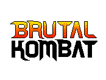

# BRUTAL KOMBAT
btw tem que baixar a biblioteca allegro 
 
**CONTROLES**
 
MENU:
- P1 escolhe: WASD
- P2 escolhe: setas
- Jogar: Enter
- Mudar cenário: C
- (Des)ativar bot: B

P1: 
- Mover: WASD
- SOCO: U
- CHUTE: I

P2:
- Mover: setas
- SOCO: 4 (teclado numérico) 
- CHUTE: 5 (teclado numérico)

---

**TOTAL ATUAL:** 50 + 10 + 15 + 30 + 5 = 110
<!-- 
    tirei 90, entreguei com um errinho no bot :(
    mas afinal, oq q tu ta fazendo aqui, curioso?
--->
 

**AFAZERES BRUTAIS:**

**--- Básicos (50pt) ---**
- Telas:
    - [X] Menu
    - [X] Ch. Select (eh, i mean, it works)
    - [X] End Game
    
- Funcionalidades
    - [X] 2 personagens 
        - [X] sprites: em pé, andando, pulando, abaixado, ataque sup, ataque inf.
    - [X] 2 player 
        - [X] mobilidade geral
        - [X] ataques (sup. e inf.)
        - [X] HP
    - [X] Melhor de 3
    
**--- """Extras""" ---**
- Telas:
    - [X] 2 cenários:                                  10pts
    - [X] Pause:                                       5pts
    
- Ataques extra:
    - [/] Ataques em pulo/ abaixado                   15pts
        - deixei os estados separados dos ataques, acho que desse jeito 
        fica mais tranquilo pra misturar 
    - [ ] Ataques Especiais (min: 2 personagens)      15pts
    - [ ] Brutalidade (fatality)                      15pts
    
- Outros atributos de personagem:
    - [ ] Defesa                                      10pts
    - [ ] Stamina                                     7.5pts
    
- Outros personagens:
    - [X] +2                                          15pts

- why.
    - [X] vs. bot                                     30pts
    
----- LEGENDA -----
 
[ ] não feito
[/] em andamento
[X] finalizado
